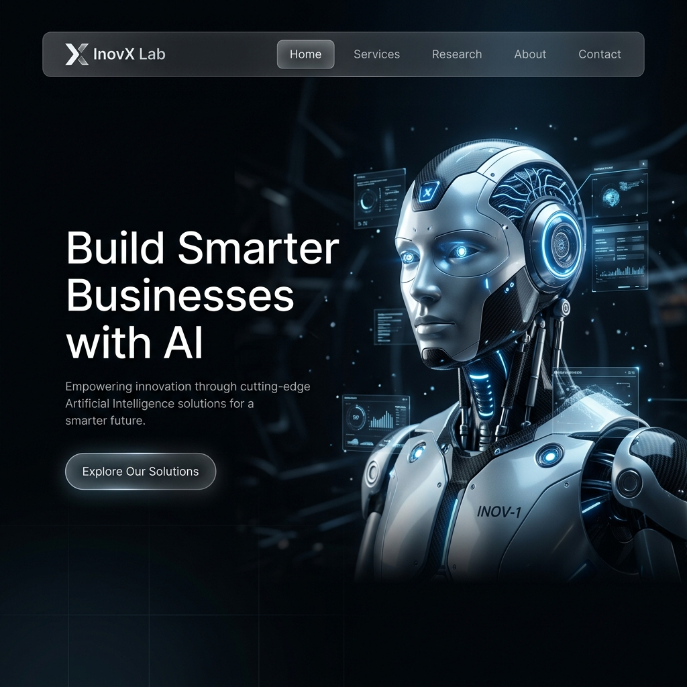
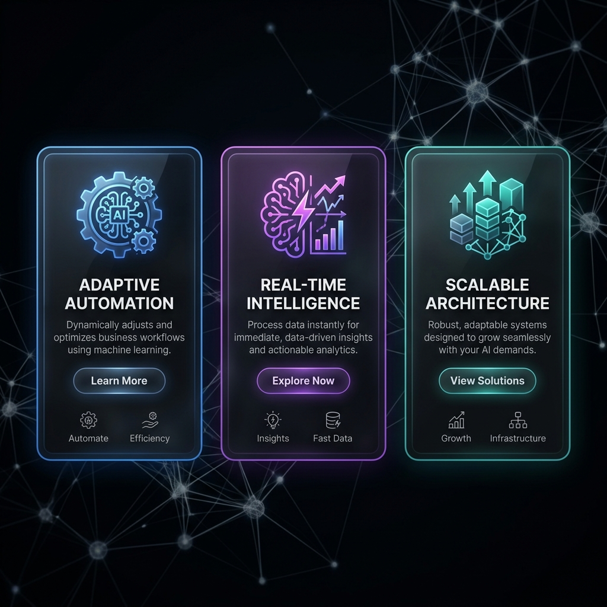
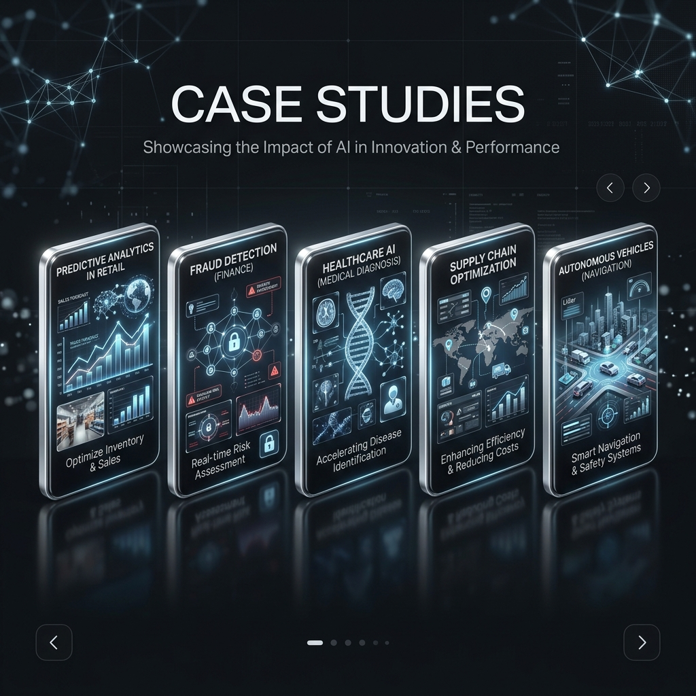

# InovX-Lab

<div align="center">

Modern AI-first web experience built with React, Vite, Tailwind CSS, and immersive 3D interactions.

[](https://vitejs.dev/)
[](https://react.dev/)
[](https://tailwindcss.com/)
[](./LICENSE)

</div>

---

## 🎨 UI/UX Concept

InovX-Lab is built on the principle of **Cinematic Interactivity**. Every element is designed to feel alive, responsive, and narratively driven.

### 🔴 Cinematic Error Handling (Try it!)
We've replaced generic error states with immersive, character-driven experiences.
- **[View 'Not Available' Demo](/not-available)**: A minimalist, high-art error state for social redirects.
- **[View 'Coming Soon' Demo](/coming-soon)**: A deep-immersion "Connection Lost" interface featuring AI robotic entities.
- **👉 Click and check these details**: Even the failure states are part of the brand story.


## 🖼 Preview





## 🚀 Overview

InovX-Lab is a modern AI solutions platform designed to showcase how intelligent systems can transform real-world business operations.

The project focuses on combining **high-end UI/UX design**, **interactive animations**, and **AI-driven concepts** into a seamless single-page experience.

It demonstrates how businesses can leverage AI for automation, real-time insights, and scalable system architecture through a visually immersive interface.

## ✨ Key Features

- 🤖 **Interactive 3D AI Hero**: Real-time robot model powered by Spline.
- ⚡ **Butter-Smooth Scrolling**: Virtualized momentum navigation with Lenis.
- 🎬 **Cinematic Narratives**: GSAP-powered scroll timelines for storytelling.
- 📊 **AI Services Showcase**: Specialized sections for Automation, Analytics, and Chat.
- 📁 **Case Studies**: Real-world implementation scenarios and project galleries.
- 📱 **Adaptive UI**: Fully responsive, mobile-first architectural design.
- ❌ **Custom 404 Pages**: Themed "Not Available" and "Coming Soon" states.
- 💬 **Neural Chatbot**: Floating AI assistant with real-time feedback logic.

## 🎯 Why This Project?

This project was built to explore how **modern web technologies + AI concepts** can be combined to create a next-generation digital experience.

It demonstrates:
- Advanced UI/UX design skills
- Real-world SPA architecture using React
- Smooth animation systems using GSAP
- Clean, scalable frontend structure

Perfect for showcasing **frontend engineering + design thinking** together.

## 🎥 Live Demo

- **[Live Demo URL](https://inovx-lab.vercel.app)** *(Coming Soon)*
- **[Interactive Demo Experience](/demo)**: A dedicated neural interface demo showcasing real-time AI processing telemetry and interactive nodes.

## 🛠 Tech Stack

### Core Frameworks
- **[React 18](https://reactjs.org/)**: For modular, component-based UI architecture.
- **[Vite 5](https://vitejs.dev/)**: For lightning-fast development and optimized production builds.
- **[Tailwind CSS](https://tailwindcss.com/)**: For utility-first styling and responsive design.

### 🎭 Animation & Interactivity
- **[Lenis](https://lenis.darkroom.engineering/)**: For buttery-smooth, high-performance momentum scrolling.
- **[GSAP (GreenSock)](https://gsap.com/)**: For advanced scroll-triggered animations and complex timeline orchestrations.
- **[Framer Motion](https://www.framer.com/motion/)**: For declarative UI transitions, micro-interactions, and simple entry animations.
- **[Spline](https://spline.design/)**: For the interactive 3D hero robot and scene management.

### Important Libraries
- **Lucide React**: For sleek, lightweight vector icons.
- **Three.js**: The underlying engine for 3D rendering and WebGL optimizations.

## 📁 Project Structure

- `src/components/` → High-level page sections (Hero, About, Services, etc.)
- `src/components/ui/` → Reusable UI primitives (Buttons, Cards, Modals) and motion-heavy components.
- `src/utils/` → Motion variants and animation helper functions.
- `public/assets/` → AI-generated images, cinematic videos, and project thumbnails.

## 🚀 Getting Started

### 1. Clone the repository
```bash
git clone https://github.com/WafryAhamed/InovX-Lab.git
cd InovX-Lab
```

### 2. Install dependencies
```bash
npm install
```

### 3. Run development server
```bash
npm run dev
```

### 4. Build for production
```bash
npm run build
```

## 📜 Acknowledgments

- **AI Generation**: All futuristic robotic illustrations, character models, and cinematic background assets were generated using advanced AI image synthesis tools to maintain a cohesive, state-of-the-art aesthetic.
- **Inspiration**: Designed with the goal of pushing the boundaries of modern web interactivity.

## 👤 Author

- **Wafry**

## 📄 License

Licensed under the [MIT License](./LICENSE).